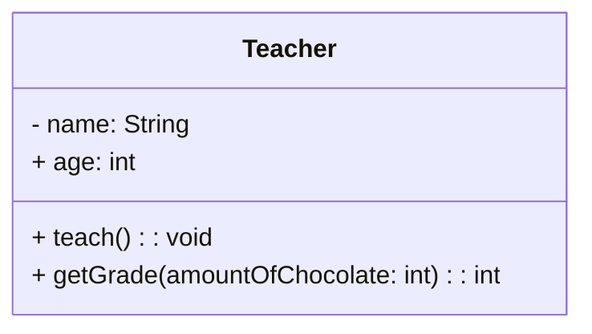

# UML - Class Diagrams

## Anatomy of a UML class
- Three versions of crab
- More qualified = more notations = more information


### Properties
- Represents structural features of a class
- Appears in two distinct notations
  - Attributes
    - Simple datatypes
  - Associations
    - Variable points to an object
- **Full syntax:** visibility name: type
  - **Example:** - wormsEaten: int

### Operations
- Operations are the actions that a class can do (Bescribes the behaviour of the class)
- Normally one would not show operations that manipulates properties in a simple way
  - Like getters and setters
- **Full syntax:** visibility name(parameter list): return type
  - **Example:** + switchImage(): void

### Associations
- Another way to notate a property
- A solid line between two classes
  - From source class to target class
- When to use associations over properties
  - Use properties when dealing with simple data types (boolean, int, float, etc.)
  - Use associations when dealing with more significant classes (Self made classes)

#### Example
This has associations to all the fields.


This is a better solution as it only has a association with the complex type.


### Dependencies
- Exists between two elements if changes to the definition of one element can cause changes to the other
- One class can depend on another


### Multiplicity (Cardinality)
- A indication of how many objects may fill the property
- They can be defined by a lower and upper bound, like 2..4.


| Multiplicity | Translation                 |
|--------------|-----------------------------|
| 0..1         | No instance or one instance |
| 1            | Exactly one instance        |
| 0..n or 0..* | Zero or more instances      |
| n or *       | One or more instances       |


--------------------------------------------------------------------------------

### Examples from class
#### Diagram

#### Code
```java
public class Teacher {
  private String name;
  public int age;

  public void teach() { ... }
  public int getGrade(int amountOfChocolate) { ... }
}
```
#### Greenfoot wombat example

